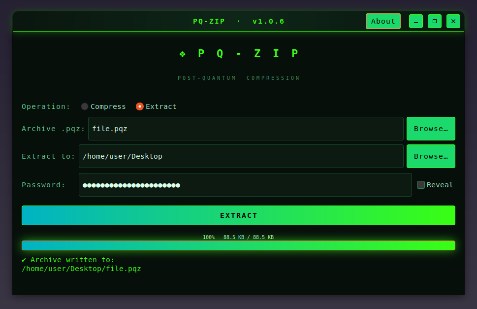

<div align="center">

# PQ-Zip

**One of the first post-quantum _compressing_ archivers.**

Pack files and folders into a single, compressed, password-protected `.pqz`
archive — sealed with authenticated encryption and an optional post-quantum
hybrid key exchange (CRYSTALS-Kyber-1024 + X448).

[](https://github.com/effjy/pq-zip/releases)
[](#license)
[](#)
[](https://www.gtk.org/)
[](#command-line-usage)
[](https://libsodium.org)
[](#the-pipeline)
[](#)

</div>

---

## Screenshot



---

## Features

- 📦 **Compress files _and_ directories** (or any mix) into one `.pqz` archive.
- 🗜️ **DEFLATE (zlib) compression** with selectable level (fast → maximum).
- 🔐 **Authenticated encryption:** AES-256-GCM (default), XChaCha20-Poly1305 or
  ChaCha20-Poly1305 — chunked, with per-chunk authentication (tamper, reorder
  and truncation detection).
- 🛡️ **Post-quantum hybrid KEM** (Kyber-1024 + X448), on by default: secure as
  long as *either* the classical or the post-quantum primitive holds.
- 🔑 **Argon2id** password key derivation (Basic / Medium / Strong).
- 🕵️ **Names stay private:** the file list and directory layout are themselves
  compressed and encrypted — they never appear in the clear.
- 🧠 **Hardened memory:** keys, passwords and plaintext are kept in locked,
  non-dumpable memory and never hit swap; intermediate stages use anonymous
  temp files that are unlinked the instant they are created.
- 🖥️ **Graphical _and_ command-line** interfaces — the CLI is ideal for
  scripting, servers and headless use.

---

## The pipeline

```
Compress:  inputs ──► archive (PQAR) ──► DEFLATE ──► AEAD encrypt ──► file.pqz
Extract:   file.pqz ──► AEAD decrypt ──► INFLATE ──► archive ──► files on disk
```

When hybrid mode is on, a per-archive Kyber-1024 + X448 keypair is generated;
its secret key is wrapped by the Argon2id password key, and the KEM shared
secret becomes the AEAD key. Decryption needs only the password.

The `.pqz` magic is `PQZIP\0\0\0`; the inner archive magic is `PQAR\0\0\0\1`.
See the header comments in [`src/crypto.c`](src/crypto.c) and
[`src/archive.h`](src/archive.h) for the exact byte layout.

---

## Prerequisites

PQ-Zip needs GTK3, libsodium, libargon2, OpenSSL (libcrypto) and zlib, plus a C
compiler and `pkg-config`. `librsvg2-bin` is only needed if you want to
regenerate the icons.

**Debian / Ubuntu / Mint**

```sh
sudo apt update
sudo apt install build-essential pkg-config \
    libgtk-3-dev libsodium-dev libargon2-dev libssl-dev zlib1g-dev \
    librsvg2-bin
```

**Fedora / RHEL**

```sh
sudo dnf install gcc make pkgconf-pkg-config \
    gtk3-devel libsodium-devel libargon2-devel openssl-devel zlib-devel \
    librsvg2-tools
```

**Arch / Manjaro**

```sh
sudo pacman -S base-devel pkgconf gtk3 libsodium argon2 openssl zlib librsvg
```

---

## Build & install

```sh
git clone https://github.com/effjy/pq-zip.git
cd pq-zip

make                 # build ./pqzip
sudo make install    # install globally: binary, icon, desktop entry
```

After installing, **PQ-Zip** appears in your applications menu (with its icon in
the window/taskbar) and `pqzip` is on your `PATH`.

Other targets:

```sh
make icons           # regenerate raster icons from the SVG (needs rsvg-convert)
make clean           # remove build artifacts
sudo make uninstall  # remove everything it installed
```

By default it installs under `/usr/local`. Override with `PREFIX`, e.g.
`sudo make install PREFIX=/usr`.

---

## Usage

### Graphical usage

Launch **PQ-Zip** from your applications menu, or run `pqzip` with no arguments.

- **Compress** — add files and/or folders to the list, choose an output `.pqz`,
  pick the cipher, key strength, compression level and whether to use hybrid
  PQC, enter a password, and click **COMPRESS**.
- **Extract** — choose a `.pqz` archive and a destination folder, enter the
  password, and click **EXTRACT**.

The work runs on a background thread with a live progress bar, so the UI never
freezes during the (deliberately heavy) key derivation.

### Command-line usage

```sh
# Compress files and a directory into one encrypted archive
pqzip c -o backup.pqz notes.txt photos/ project/

# Extract into a destination directory (default ".")
pqzip x backup.pqz ./restored
```

**Options**

| Option            | Applies to | Meaning                                            |
|-------------------|------------|----------------------------------------------------|
| `-o FILE`         | compress   | output `.pqz` file (required)                       |
| `-d DIR`          | extract    | destination directory (default `.`)                |
| `-p PASSWORD`     | both       | password (see precedence below)                    |
| `--cipher NAME`   | compress   | `aes` (default), `xchacha`, `chacha`               |
| `--kdf LEVEL`     | compress   | `basic`, `medium` (default), `strong`              |
| `--level N`       | compress   | zlib compression level `0`–`9` (default `6`)       |
| `--no-hybrid`     | compress   | disable Kyber-1024 + X448 (classical encryption)   |
| `-q`, `--quiet`   | both       | suppress progress output                           |
| `--help`          |            | full option list                                   |
| `--version`       |            | print version                                      |

**Password precedence:** `-p` → `$PQZIP_PASSWORD` → interactive no-echo prompt
(with confirmation when compressing).

**More examples**

```sh
# Maximum compression, strongest KDF, XChaCha20
pqzip c -o secure.pqz --cipher xchacha --kdf strong --level 9 project/

# Classical-only encryption, password from the environment, no progress
PQZIP_PASSWORD='correct horse battery staple' \
    pqzip c -q --no-hybrid -o a.pqz file1 file2

# Extract to a specific folder
pqzip x a.pqz -d ./out
```

---

## How it works under the hood

1. **Archive** — the chosen files and folders are serialised into one PQAR
   stream (each input keeps its basename as the root of its stored path, so
   extraction recreates `file.txt` or `project/sub/file`).
2. **Compress** — the archive is streamed through zlib DEFLATE.
3. **Encrypt** — the compressed stream is split into 64 KiB chunks; each chunk
   is sealed with the chosen AEAD using a per-chunk nonce and associated data
   that binds its position, so reordering or truncation is detected.

Extraction reverses the three stages. Paths in an archive are validated on
extraction (absolute paths and `..` components are rejected) so a malicious
archive cannot escape the destination directory.

---

## License

MIT/X11 © 2026 Jean-Francois Lachance-Caumartin.
